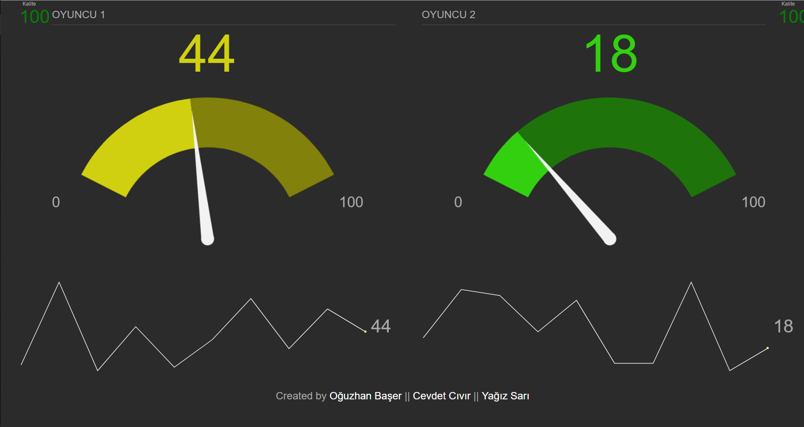

# NeuroSky-Race

In this application you can use your attention level to control car speed. Application designed for two racers. In this application you will need following items:

    - NeuroSky Mindwave Sensors * 2
    - Arduino (Nano in this example but can be different) * 2
    - IRFZ44N Mosfet * 2
    - HC-05 Bluetooth * 2
    - Slot Car Track
    - MZ-80 (Optional) * 2
    - FTDI Converter(Optional) * 2
    - PC (Optional)


### First-Upload
For the first UPLOAD you have to uncomment this line in "configuration.h". Next time you can comment it again. This line saves speed levels to EEPROM. 

```arduino

//#define WRITE_EEPROM 

```

If you want to use NodeJs web interface you will need a PC to run server. Connect two Arduino with USB cable to PC and set port names in "server.js"

```javascript
var portName1 = "COM5";
var portName2 = "COM13";
```

```sh

$ cd Web-Interface
$ npm install
$ node server.js

```

</img>

You can use FTDI converter or direct Arduino USB Plug to connect PC with Serial communication. You should uncomment this line in "configuration.h" and use A4 as RX, A5 as TX pin

```arduino

//#define USE_EXTERNAL_USB

```

## CARS WILL NOT MOVE IF .. !!
In this application if there are not two racers which are signal qualites equals zero(means max signal quality) cars cannot move. I needed this specification for race concept. If you want to disable it, comment this line in "configuration.h"

```arduino

#define MAKE_GAME

```
